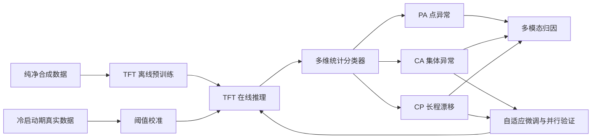
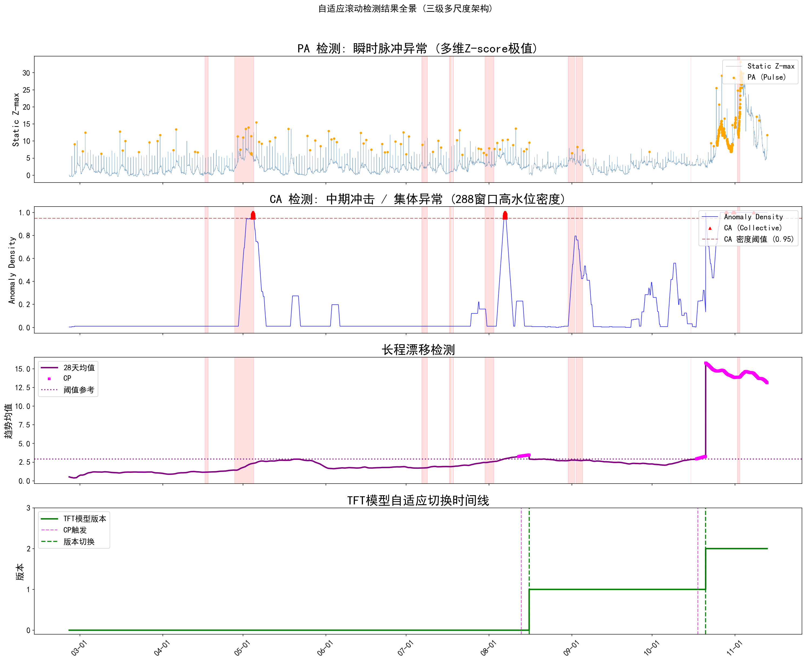

# 基于多模态社交媒体时序数据的开放世界手游效益突变预警系统研究

> 多模态时序分析 · 无监督异常检测 · 可解释风险预警

本项目面向“游戏即服务”（GaaS）模式下的长期运营风险，构建了一套从**多模态社交媒体数据采集、纯净基准数据合成、无监督分层检测到业务归因**的完整预警框架。系统将微博文本、图片和官方运营事件转换为 15 分钟级时序信号，识别点异常（PA）、集体异常（CA）与长程漂移（CP），并通过文本主题和高频图片解释风险来源。


## 项目概览

| 维度 | 最终答辩口径 |
| --- | --- |
| 研究案例 | 开放世界手游《无限暖暖》 |
| 数据平台 | 微博广场、官方微博评论区、官方运营日历 |
| 数据范围 | 2024-12-05 至 2025-11-26，覆盖开服、1.0 至 1.11 版本 |
| 数据规模 | 广场发言 95 万+、评论 30 万+、图片 104 万+ |
| 时间粒度 | 15 分钟 |
| 特征体系 | 5 个维度、19 项多模态时序特征 |
| 核心方法 | 结构化分解与逆向合成、Gaussian Copula、双路 TFT、统计分层检测 |
| 在线实验 | 261 天、25,056 个窗口 |
| 已知危机 | 依据官方道歉公告构建 10 个事件，系统检出 6 个 |

## 研究问题

高投入、长周期的开放世界手游，其商业效益与持续的玩家口碑高度相关。当前舆情监控通常依赖人工巡检和关键词规则，难以应对四项关键挑战：

1. **多模态信息难以统一建模**：文本、图片、互动结构和运营活动同时变化；
2. **正常训练数据受到历史异常污染**：真实标签稀缺，直接使用历史数据会让无监督模型学习到异常模式；
3. **不同时间尺度的异常相互割裂**：瞬时突发、持续震荡和长期基线漂移需要统一识别；
4. **静态模型会随运营周期失效**：版本更迭和玩家群体变化会持续改变数据分布。

因此，本研究的目标不是单纯判断“是否负面”，而是构建一套能够长期运行的自动化异常检测与归因系统，为运营决策提供可解释的量化证据。

## 主要贡献

1. **多模态时序特征工程**：将文本、情感、语义、传播结构与视觉形态统一映射为 19 维时序特征；
2. **纯净训练基准构建**：提出多层结构化分解与逆向合成框架，生成不受历史真实异常污染的平稳训练数据；
3. **统一分层检测与自适应更新**：从 TFT 推理结果提取多维偏差信号，在同一框架下识别 PA、CA 与 CP，并通过微调、并行验证和安全切换追踪新基线；
4. **多模态业务归因**：结合文本主题建模和视觉哈希聚类生成可解释预警报告。

## 方法设计

### 1. 多模态特征工程

以 15 分钟为窗口，从广场微博和官方评论两类来源构建 5 个维度、19 项指标：

| 特征维度 | 代表性指标 | 技术方法 |
| --- | --- | --- |
| 规模与参与结构 | 讨论量、用户发言集中度、转发占比 | 计数统计、Gini 系数、阻尼修正 |
| 文本形态 | 情绪符号烈度、文本压缩比、长短文本计数 | LZ77 压缩比、规则统计 |
| 情感形态 | 帖子与评论负面占比 | 中文 RoBERTa、领域词典修正、贝叶斯平滑 |
| 语义漂移 | 相邻窗口语义中心距离 | 多语言 SBERT、余弦距离 |
| 视觉形态 | 视觉绝对冗余量、视觉集中度 | pHash、海明距离、Union-Find 聚类 |

在真实 BUG 舆情案例中，讨论量上升的同时，文本压缩比下降、负面占比与视觉冗余上升，而转发占比没有同步剧烈变化。这组联合信号能够区分玩家自发讨论与常规运营转发活动。

### 2. 结构化分解与逆向合成

无监督模型需要学习“正常状态”，但历史真实数据混有危机事件。本研究选取约 5,665 个相对平稳窗口作为分解样本，按数据生成机制逐层提取结构：

```text
偏度变换
  → Prophet 版本趋势与日/周周期
  → 官方运营事件冲击与指数衰减
  → AR 短期自相关
  → GARCH 族条件异方差
  → 残差清洗与边缘分布拟合
  → Gaussian Copula 多维相关噪声
  → 按相反顺序回填结构并逆变换
  → 纯净合成基准数据
```

合成质量从矩统计量、1 至 20 阶自相关结构和尾部分位数三个维度评估。目标与合成数据相关矩阵的平均绝对误差为 `0.0075`，主要相关结构得到较好恢复。

### 3. TFT 分层检测与自适应更新



系统使用纯净合成数据离线预训练两个独立 TFT 子模型：

- 评论侧第一主成分：`Comment PC1`；
- 广场侧第二主成分：`Post PC2`。

每个子模型提取残差比、注意力 KL 散度、变量选择 JS 散度和 Spearman 秩相关距离 4 类信号；两路模型共产生 8 维静态信号，再加入窗口大小为 8 的滚动最大值，形成 16 维综合偏差向量。

| 风险层级 | 业务含义 | 判定路径 |
| --- | --- | --- |
| PA：点异常 | 单个或少量窗口的瞬时突发 | 滚动偏差信号阈值与多通道投票 |
| CA：集体异常 | 一段时间内持续、稳定的异常震荡 | 多维 Z-score 最大值序列与密度—波动率双约束 |
| CP：长程漂移 | 底层数据生成机制和模型基线发生变化 | 28 天长期滑动均值判定 |

CA 触发后先延迟确认并向未来收集新常态数据；CP 触发后立即回溯近期数据。两条轨道最终进入“重新标准化—解冻 TFT 顶层参数—重新校准阈值—新旧模型并行验证—安全切换”的更新闭环。

### 4. 多模态归因

预警触发后，系统从三个层面形成业务解释：

- **时空定位**：按异常类型确定归因窗口，并根据偏差信号定位主导子模型和特征来源；
- **文本归因**：使用 SBERT 表示负面短句，匹配已知主题，并通过 UMAP、HDBSCAN 与 class-based TF-IDF 探索未知主题；
- **视觉归因**：复用特征工程阶段的 pHash 聚类结果，提取窗口内 Top-N 高频图片。

## 最终实验结果

261 天的离线在线检测模拟覆盖 25,056 个窗口：

- 正常窗口 `24,013` 个，占 `95.81%`；
- PA 窗口占 `3.76%`，聚合形成 `90` 段点异常事件；
- CA 窗口占 `0.27%`，形成 `5` 段集体异常事件；
- CP 窗口占 `0.16%`，触发 `2` 次长程漂移和 `2` 次模型切换；
- PA 触发来源中，评论子模型约占 `83%`，说明官方评论区对突发情绪具有更明显的聚集效应；
- 偏差信号来源中，变量选择排序距离约占 `87%`，说明预警的核心诱因主要是舆论焦点特征结构的突发重组。



### 已知危机验证

依据官方道歉公告构建 10 个已知危机事件，系统检出 6 个，整体检出率为 `60%`：

- Level 2 事件检出率 `100%`；
- Level 3 事件检出率 `75%`；
- Level 1 事件检出率 `25%`。

未检出事件主要对应三类边界：危机源头帖子及评论被删除导致证据缺失、持续不足 15 分钟的技术故障被窗口平滑、个体偶发行为缺乏统计显著性。

### 长期基线自适应

全周期发生两次模型切换：第一次发生在暑期高活跃和多起危机密集出现后，系统向上调整基准；第二次发生在危机消退、真实环境回归低波动后，系统向下修正基准。结果体现了自适应机制对高震荡与回归平稳两种状态的双向校正能力。

### 官方危机池外异常

- 76 段池外 PA 中，约 `43%` 对应官方未明确回应的微观真实缺陷；
- 其余 PA 揭示了低活跃、极小样本量场景下的统计敏感性边界；
- 4 段池外 CA 主要对应两类机制：运营策略与玩家诉求的结构性偏差，以及历史危机后的基线偏移与情绪泛化。

## 代码导航

| 研究环节 | 代码入口 | 补充说明 |
| --- | --- | --- |
| 01 数据采集 | [`notebooks/01_data_collection`](notebooks/01_data_collection) · [`scripts/01_data_collection`](scripts/01_data_collection) | [采集代码盘点](docs/01_data_collection_inventory.md) |
| 02 特征工程 | [`notebooks/02_feature_engineering`](notebooks/02_feature_engineering) · [`scripts/02_feature_engineering`](scripts/02_feature_engineering) | [特征工程审查](docs/02_feature_engineering_review.md) |
| 03 时序分解合成 | [`notebooks/03_decomposition_synthesis`](notebooks/03_decomposition_synthesis) · [`scripts/03_decomposition_synthesis`](scripts/03_decomposition_synthesis) | [分解合成审查](docs/03_decomposition_synthesis_review.md) |
| 04 TFT 检测 | [`scripts/04_tft_detection/final`](scripts/04_tft_detection/final) | [最终版运行说明](scripts/04_tft_detection/final/README.md) · [版本选择](docs/04_tft_version_selection.md) |
| 05 内容归因 | [`scripts/05_content_attribution`](scripts/05_content_attribution) · [`notebooks/05_content_attribution`](notebooks/05_content_attribution) | [归因模块说明](scripts/05_content_attribution/README.md) |

## 复现入口

安装 TFT 阶段依赖并运行轻量测试：

```bash
pip install -r requirements/tft_detection.txt
pytest -q
```

准备好私有数据、路径变量和 GPU 环境后，论文最终主链路按以下顺序运行：

```bash
python scripts/04_tft_detection/final/notebook_v7_train.py
python scripts/04_tft_detection/final/notebook_v7_run.py
python scripts/04_tft_detection/final/notebook_v7_figures.py
```

训练默认保留最终 Notebook 的 300 轮设置。完整环境变量、输入文件与输出路径见[最终代码说明](scripts/04_tft_detection/final/README.md)。

## 版本边界

- **论文结果复现版**：以 `scripts/04_tft_detection/final/notebook_v7_*` 为准，代码直接提取自最终 Notebook 或仅做路径便携化；
- **作品集阅读版**：`signals.py`、`statistical_classifier.py`、`adaptive_state.py` 与 `pipeline.py` 用于理解核心逻辑和轻量测试；
- **历史研究版本**：集中在各阶段的 `legacy/` 目录；
- **废弃对照路线**：异常注入与 LightGBM 位于 [`experiments/04_tft_detection`](experiments/04_tft_detection)，仅记录研究取舍，不属于最终方案。

## 局限性

1. 数据仅覆盖微博单一平台，尚未融合其他社区和内部运营指标；
2. 固定 15 分钟窗口对极短时异常存在结构性盲区；
3. 无监督统计标签尚不能直接判断责任归属；
4. 当前以离线数据模拟在线运行，尚未完成生产环境的流式部署；
5. 目前仅在单一开放世界手游案例上验证，仍需跨产品与跨行业泛化评估。

## 数据与隐私边界

- 仓库不提交真实 Cookie、登录凭据、原始微博文本、用户信息和原始用户图片；
- Notebook 历史输出已清除，`data/raw/` 只保留数据字段与放置说明；
- 训练权重和完整中间数据不公开，因此公开代码可验证结构和轻量逻辑，但不能脱离私有数据复现全部论文数值；
- 首页仅使用脱敏后的实验聚合图，不包含学校、姓名、学号、导师信息、用户名或原始用户发言；
- 采集代码仅用于研究复现，使用时应遵守平台规则、适用法律与合理的请求频率限制。

项目作者：Aelita Li
